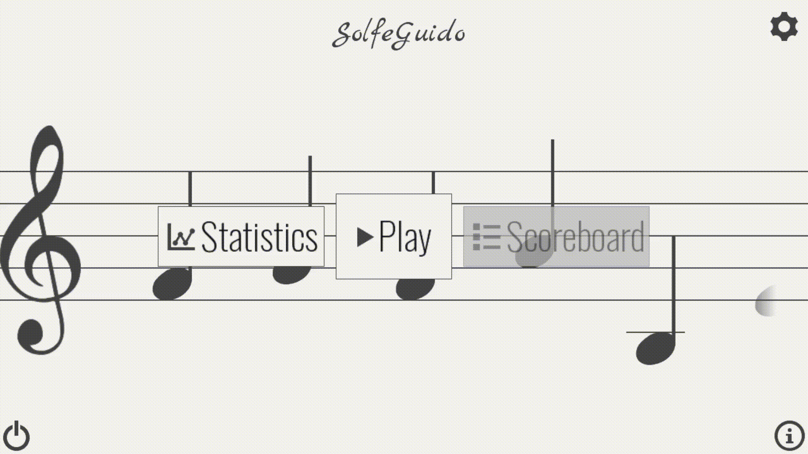

# SolfeGuido2
Learn to read a music sheet the fun way !

SolfeGuido2 is a complete rewrite of the first version.
It was created as a mobile and desktop game.
It works on computer, but is more enjoyable on a phone or tablet.

## Features

- Train to read on three keys :
    - G clef
    - F clef
    - F & G clef
    - Ut 3 clef
    - Ut 4 clef

- Unlock levels and progress step by step when learning a new key
- Lear to read a music sheet using all the possible key signatures

* Many stats are available (and more to come) :
    - Number of games played
    - Number of points won
    - Average reaction time
    - Wrong notes guessed
    - Total time played

## Example

